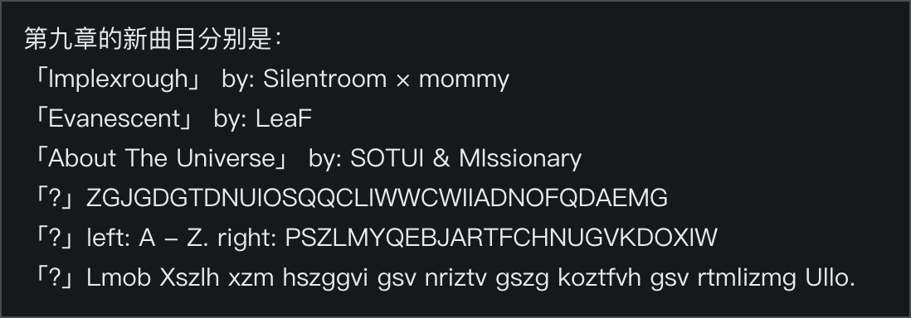
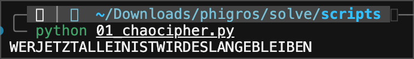
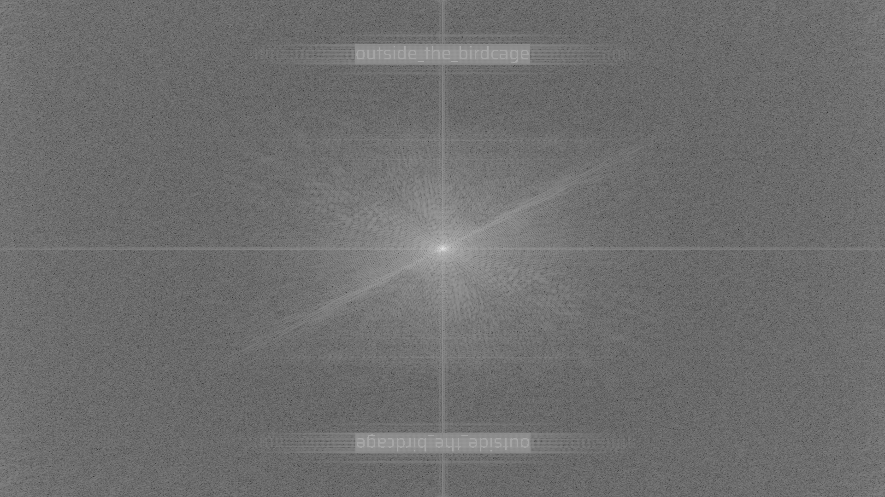
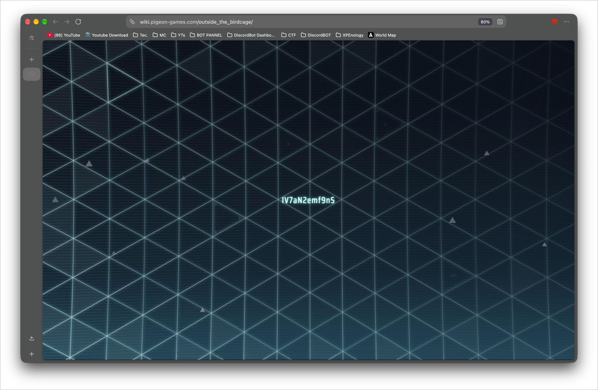
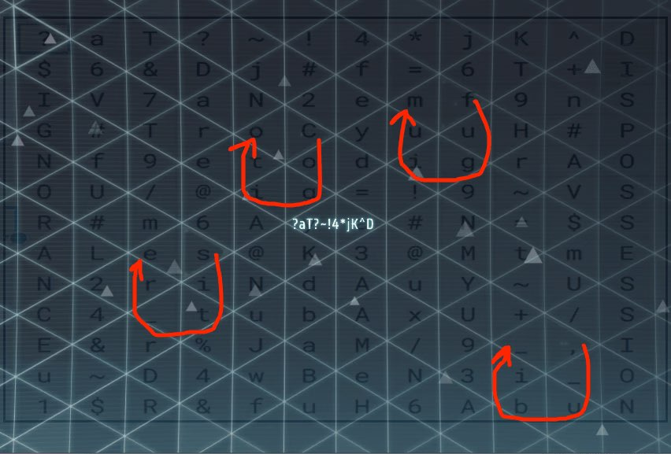
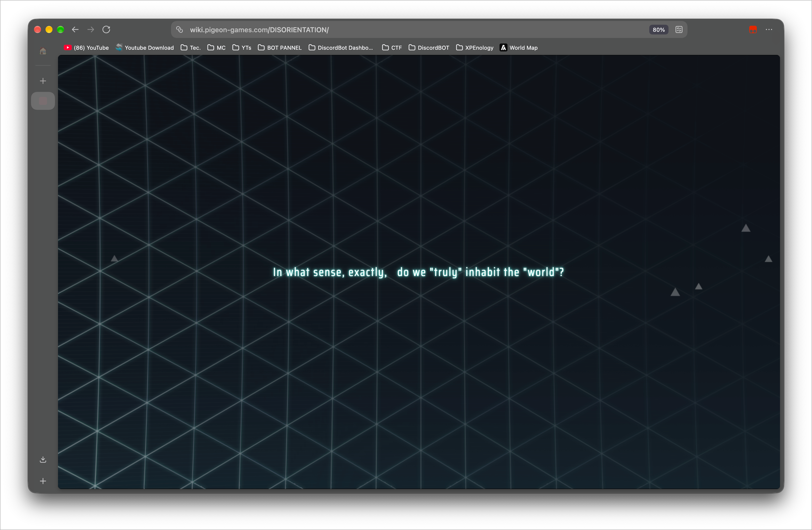
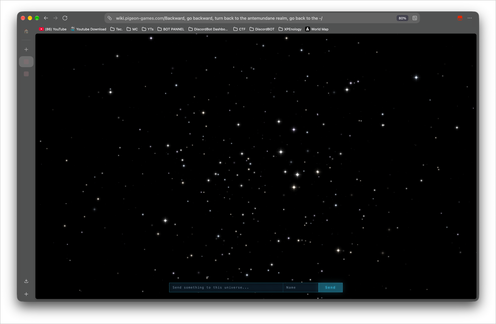

# spoiler spoiler spoiler spoiler spoiler
DO NOT READ IF YOU HAVENT UNLOCK CH9 AND WANT TO AVOID ANY SPOILER

## Atbash

The PV is https://www.bilibili.com/video/BV16vbN6REhD/


One description line is `Lmob Xszlh xzm hszggvi gsv nriztv gszg koztfvh gsv rtmlizmg Ullo.` It is Atbash: `A` swaps with `Z`, `B` with `Y`, and the same for the rest of the alphabet. Case and spaces stay put. The line reads "Only Chaos can shatter the mirage that plagues the ignorant Fool."

## Chaocipher

The same description prints the layout Chaocipher uses for its two disks.

```text
left:  ABCDEFGHIJKLMNOPQRSTUVWXYZ
right: PSZLMYQEBJARTFCHNUGVKDOXIW
ciphertext: ZGJGDGTDNUIOSQQCLIWWCWIIADNOFQDAEMG
```

this script takes one ciphertext letter at a time. It finds that letter in the left alphabet and reads the right alphabet at the same index. That right-hand letter is the plaintext letter. Both alphabets then rotate until the position just used sits at the top. On the left alphabet, the letter just after the top moves down to position 14. On the right alphabet, the top letter moves to the end, and the letter now at index 2 moves down to position 14. After every letter, the plaintext is `WERJETZTALLEINISTWIRDESLANGEBLEIBEN`.

That is the Rilke line "Wer jetzt allein ist, wird es lange bleiben" with the spaces deleted. 


```python
LEFT = "ABCDEFGHIJKLMNOPQRSTUVWXYZ"
RIGHT = "PSZLMYQEBJARTFCHNUGVKDOXIW"
CT = "ZGJGDGTDNUIOSQQCLIWWCWIIADNOFQDAEMG"


def permute(left, right, pos):
    left = left[pos:] + left[:pos]
    left = left[0:1] + left[2:14] + left[1:2] + left[14:]
    right = right[pos:] + right[:pos]
    right = right[1:] + right[:1]
    right = right[0:2] + right[3:14] + right[2:3] + right[14:]
    return left, right


def decrypt(ct, left=LEFT, right=RIGHT):
    left, right = list(left), list(right)
    out = []
    for ch in ct:
        pos = left.index(ch)
        out.append(right[pos])
        left, right = permute(left, right, pos)
    return "".join(out)


print(decrypt(CT))
```

## Solivault
I tried it as an address:

https://wiki.pigeon-games.com/WERJETZTALLEINISTWIRDESLANGEBLEIBEN/


The picture looks empty. What I *DO* know is that text buried in an image often turns up in the Fourier spectrum (yes i study computer science). this script finds each PNG header in the downloaded background, converts the first picture to grayscale, and prints its size plus the size of the log-scaled centered FFT

```python
from pathlib import Path

import numpy as np
from PIL import Image

ROOT = Path(__file__).resolve().parents[1]
SRC = ROOT / "start-0.png"
OUT = ROOT / "start-0-fft.png"


def save_fft(src, dest):
    im = Image.open(src).convert("L")
    arr = np.asarray(im, dtype=np.float32)
    spec = np.fft.fftshift(np.fft.fft2(arr))
    mag = np.log1p(np.abs(spec))
    mag = mag / mag.max() * 255
    Image.fromarray(mag.astype(np.uint8)).save(dest)
    return im.size


if __name__ == "__main__":
    size = save_fft(SRC, OUT)
    print(SRC, size)
    print(OUT)

```
Output:


## Birdcage

That spectrum is the next address: https://wiki.pigeon-games.com/outside_the_birdcage/
  

I found that by looking at the HTTP response when requesting https://wiki.pigeon-games.com/outside_the_birdcage/api.php?fp=8a61a8b1b84b205a5787cdec683bab58
It says `{"ok":true,"index":12,"text":"1$R&fuH6AbuN","total":13}` thres total 13, and different `fp=` returns different text.
This step takes forever even when I use a python script, they have a potato server and they keep sending me the same text...
I tried using different User-Agent, different UA Version, wait a bit if keep repeating, sending a bunch of requests and eventually i got that...

```py
import json
import random
import time
import urllib.error
import urllib.request
from concurrent.futures import ThreadPoolExecutor

API = "https://wiki.pigeon-games.com/outside_the_birdcage/api.php?fp="


def chrome(v):
    return (
        "Mozilla/5.0 (Windows NT 10.0; Win64; x64) "
        f"AppleWebKit/537.36 (KHTML, like Gecko) Chrome/{v}.0.0.0 Safari/537.36"
    )


def firefox(v):
    return (
        f"Mozilla/5.0 (Windows NT 10.0; Win64; x64; rv:{v}.0) "
        f"Gecko/20100101 Firefox/{v}.0"
    )


def batch_uas(k=10):
    versions = set()
    while len(versions) < k:
        versions.add(random.randint(1, 131))
    uas = []
    for i, v in enumerate(versions):
        uas.append(chrome(v) if i % 2 == 0 else firefox(v))
    return uas


def fnv(s, seed):
    h = seed & 0xFFFFFFFF
    for ch in s:
        h ^= ord(ch)
        h = (h * 16777619) & 0xFFFFFFFF
    return h


def fingerprint(user_agent):
    langs = random.choice(["en-US", "zh-CN", "ja-JP", "en-GB", "zh-TW"])
    screen = (
        f"{random.randint(1280, 2560)}x{random.randint(720, 1600)}"
        f"x{random.choice([24, 30, 32])}x{random.choice([1, 2])}"
    )
    parts = [
        user_agent,
        langs,
        langs,
        "Win32",
        "hc" + str(random.choice([4, 8, 12, 16])),
        "dm" + str(random.choice([4, 8, 16])),
        "mt" + str(random.choice([0, 1, 5, 10])),
        "sc" + screen,
        "tz" + str(random.choice([-480, -420, -60, 0, 60, 540])),
        "zone" + random.choice(["Asia/Shanghai", "America/Los_Angeles", "Europe/London", "Asia/Tokyo"]),
        "cv" + "".join(random.choice("ABCDEFGHIJKLMNOPQRSTUVWXYZabcdefghijklmnopqrstuvwxyz0123456789+/") for _ in range(80)),
        "gv" + random.choice(["Google Inc. (NVIDIA)", "Google Inc. (Intel)", "Google Inc. (AMD)"]),
        "gr" + random.choice(["ANGLE (NVIDIA, D3D11)", "ANGLE (Intel, D3D11)", "ANGLE (AMD, D3D11)"]),
    ]
    s = "|".join(parts)
    return (
        f"{fnv(s, 2166136261):08x}"
        f"{fnv(s, 1099511628):08x}"
        f"{fnv(s + '#2', 2166136261):08x}"
        f"{fnv(s + '#3', 1099511628):08x}"
    )


def fetch(fp, ua):
    # print("fetching", fp, ua, flush=True)
    req = urllib.request.Request(
        API + fp,
        headers={"User-Agent": ua, "Referer": "https://wiki.pigeon-games.com/outside_the_birdcage/"},
    )
    delay = 5
    for _ in range(6):
        try:
            with urllib.request.urlopen(req, timeout=30) as r:
                data = json.loads(r.read().decode())
            break
        except urllib.error.HTTPError as e:
            if e.code == 404:
                print("404", fp, flush=True)
                return None
            if e.code != 502:
                raise
            print("502, retry in", delay, flush=True)
            time.sleep(delay)
            delay = min(delay * 2, 40)
    else:
        raise RuntimeError("502")
    if not data.get("ok"):
        raise RuntimeError(data)
    return data["index"], data["text"], data["total"]


def collect(limit=100000): # fucking limits
    found = {}
    total = None
    n = 0
    repeats = 0
    with ThreadPoolExecutor(max_workers=20) as pool:
        while len(found) < (total or 13) and n < limit:
            uas = batch_uas(10)
            batch = []
            for ua in uas:
                if n >= limit:
                    break
                fp = fingerprint(ua)
                batch.append((fp, ua))
                n += 1
            for got in pool.map(lambda pair: fetch(*pair), batch):
                if got is None:
                    continue
                index, text, got_total = got
                total = got_total
                if index in found:
                    repeats += 1
                    print("repeat", index, repr(text), flush=True)
                    if repeats > 20:
                        print("20 repeats, wait 5s", flush=True)
                        time.sleep(5)
                        repeats = 0
                else:
                    found[index] = text
                    repeats = 0
                    print(index, repr(text), flush=True)
            if len(found) >= (total or 13):
                break
    if total is None or len(found) < total:
        raise RuntimeError(f"got {sorted(found)} of {total} after {n} requests")
    return [found[i] for i in range(total)]


if __name__ == "__main__":
    for i, text in enumerate(collect()):
        print(i, repr(text))
```

Stack all 13 in the order the server numbers them:

```text
?aT?~!4*jK^D
$6&Dj#f=6T+I
IV7aN2emf9nS
G#TroCyuuH#P
Nf9etodigrAO
OU/@ig=!9~VS
R#m6Aya#N=$S
ALes@K3@MtmE
N2riNdAuY~US
C4_tubAxU+/S
E&r%JaM/9_,I
u~D4wBeN3i_O
1$R&fuH6AbuN
```

read along the triangle background grid. The marked cells read `Cogito,_ubi_sit_refugium` (Latin, "I think, where is the refuge."")


https://wiki.pigeon-games.com/Cogito,_ubi_sit_refugium/

## Morse

The Cogito title is `.Bravo _Charlie ␣Delta`. Bravo, Charlie, and Delta name three invisible characters: `U+200B`, `U+200C`, and `U+200D`. They sit after the sentence on that page. `U+200B` is a dot, `U+200C` is a dash, `U+200D` ends a letter.

```text
-.. .. ... --- .-. .. . -. - .- - .. --- -.
```

Reads `DISORIENTATION`

https://wiki.pigeon-games.com/DISORIENTATION/


The same three characters are on that page:

```text
.- .-. --- ..- ... .- .-..
```

That is `AROUSAL`.

## Nihilist

The page title is `nihilist`. In the source, a meta tag whose name is a single space holds the ciphertext:

```html
<meta name=" " content="56 75 65 76 35 56 75 63 97 66 67 47 72">
```

A comment there says the pieces you already have cannot be used as they are, and that you have to take the interference out. A nihilist cipher puts letters on a 5 by 5 grid. A letter becomes two digits: the row, then the column, both counted from 1.

### Where `PSZLMYQEBJARTFCHNUGVKDOXW` comes from

The grid has 25 cells. The alphabet has 26 letters, so one letter has nowhere to sit. Ordinary Polybius handles that one extra letter by making `I` and `J` share a cell

```text
P S Z L M Y Q E B J A R T F C H N U G V K D O X I W
```

Read it left to right. `J` shows up first, in `...EBJART...`, and takes the shared cell. `I` shows up later, in `...DOXIW`. Delete only that `I`. The `W` after it slides left, next to `X`:

```text
P S Z L M Y Q E B J A R T F C H N U G V K D O X W
```

Joined up, that is `PSZLMYQEBJARTFCHNUGVKDOXW`. Five letters per row:

```text
   1 2 3 4 5
1  P S Z L M
2  Y Q E B J
3  A R T F C
4  H N U G V
5  K D O X W
```

If you use a Nihilist tool, set it to decode, put `PSZLMYQEBJARTFCHNUGVKDOXW` in the alphabet box, and `AROUSL` in the key box. The ciphertext box gets `56 75 65 76 35 56 75 63 97 66 67 47 72`.

### Where `AROUSL` comes from

`AROUSAL` is the repeating key. A normal Nihilist key keeps a letter that shows up twice, so dropping one is not the usual rule. The page comment still says this word cannot be used as written. It never names `A`. Looking at the word, every other letter appears once:

```text
A R O U S A L
```

`A` is the letter that appears twice. The second copy, the sixth letter, is the one I removed

```text
A R O U S L
```

### Why `AROUSAL` is `31 32 53 43 12 31 14`

Same grid. Row digit first, column digit second.

`A` is row 3, column 1, so `31`.

`R` is still row 3, one column over, so `32`.

`O` is row 5, column 3, so `53`.

`U` is row 4, column 3, so `43`.

`S` is row 1, column 2, so `12`.

The sixth letter is `A` again, the same cell, so `31` again.

`L` is row 1, column 4, so `14`.

`A R O U S A L` is therefore `31 32 53 43 12 31 14`.

### What goes wrong if you keep both A's

Lay that seven-number key under the ciphertext. It repeats after `14`.

```text
ciphertext   56  75  65  76  35  56  75  63  97  66  67  47  72
key letter    A   R   O   U   S   A   L   A   R   O   U   S   A
key number   31  32  53  43  12  31  14  31  32  53  43  12  31
```

Subtract:

```text
56 - 31 = 25   row 2, column 5   J
75 - 32 = 43   row 4, column 3   U
65 - 53 = 12   row 1, column 2   S
76 - 43 = 33   row 3, column 3   T
35 - 12 = 23   row 2, column 3   E
56 - 31 = 25   row 2, column 5   J
75 - 14 = 61   row 6, column 1   no cell
63 - 31 = 32   row 3, column 2   R
97 - 32 = 65   row 6, column 5   no cell
66 - 53 = 13   row 1, column 3   Z
67 - 43 = 24   row 2, column 4   B
47 - 12 = 35   row 3, column 5   C
72 - 31 = 41   row 4, column 1   H
```

Rows only go from 1 to 5. Both of those ask for row 6. No letter lives there. What you can read is `JUSTEJ`, a hole, `R`, another hole, `ZBCH`.

### The subtraction that works

Drop the second `A` and the key is six numbers: `31 32 53 43 12 14`. Thirteen ciphertext numbers, so the key starts over:

```text
ciphertext  56  75  65  76  35  56  75  63  97  66  67  47  72
key         31  32  53  43  12  14  31  32  53  43  12  14  31
subtract    25  43  12  33  23  42  44  31  44  23  55  33  41
letter       J   U   S   T   E   N   G   A   G   E   W   T   H
```

Use this script:

```python
ALPHABET = "PSZLMYQEBJARTFCHNUGVKDOXIW".replace("I", "")
CIPHER = [56, 75, 65, 76, 35, 56, 75, 63, 97, 66, 67, 47, 72]
KEY = "AROUSL"


def square():
    return {ch: divmod(i, 5) for i, ch in enumerate(ALPHABET)}


def coords(text, table):
    out = []
    for ch in text:
        row, col = table[ch]
        out.append((row + 1) * 10 + (col + 1))
    return out


def decrypt(cipher, key):
    table = square()
    key_nums = coords(key, table)
    inv = {v: ch for ch, v in table.items()}
    letters = []
    for i, num in enumerate(cipher):
        diff = num - key_nums[i % len(key_nums)]
        row, col = divmod(diff, 10)
        letters.append(inv[(row - 1, col - 1)])
    return letters


key_nums = coords(KEY, square())
letters = decrypt(CIPHER, KEY)
for r in range(5):
    print(" ".join(ALPHABET[r * 5:(r + 1) * 5]))
print(KEY, key_nums)
print([c - key_nums[i % len(key_nums)] for i, c in enumerate(CIPHER)])
print("".join(letters))
```

Go:
https://wiki.pigeon-games.com/JUSTENGAGEWTH/

The page says `just need 1 step`. Clicking the sentence copies one of `NO-`, `row: 4? 5?`, `\/\/\/`, `try for yourself`, or `-SO`.

## Zigzag

`\/\/\/` is the shape of the reading. `NO-` and `-SO` are the two ends. `row: 4? 5?` is where it starts.

The letters come from the 13 Birdcage slogans above. One visit only gives you one row, so the script has all 13 pasted in, in server order. Row 4 starts with `N`. Row 5 starts with `O`, matching "NO-"

Starting on row 5, down row 6, ..., down row 7, down row 8, and end at `SO`, make sure every other arrows are parallel, also draw exaectly to the provided pattern `\/\/\/`.


The 24 letters are `NOL2re@etiKdA3!ig9t~UmSO`

## End

Those 24 letters are the last address:

https://wiki.pigeon-games.com/NOL2re@etiKdA3!ig9t~UmSO/

The page is titled `End`. The line on it is the passkey at the top of this file.


## Easter egg
You can leave a message at 
https://wiki.pigeon-games.com/Backward,%20go%20backward,%20turn%20back%20to%20the%20antemundane%20realm,%20go%20back%20to%20the%20-/

Your message will be encrypted to others
